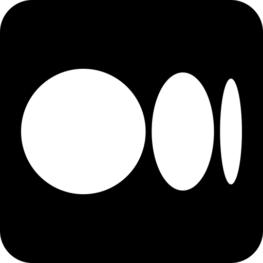

# Samet Girgin 

**`Data Analyst • Engineer • Problem Solver • ML Enthusiast`**

🔭 I’m currently working on data analysis 

## Socials

 
 
 

**Email:** sametgirgin@gmail.com

<!--
**sametgirgin/sametgirgin** is a ✨ _special_ ✨ repository because its `README.md` (this file) appears on your GitHub profile.

Here are some ideas to get you started:

- 🔭 I’m currently working on ...
- 🌱 I’m currently learning ...
- 👯 I’m looking to collaborate on ...
- 🤔 I’m looking for help with ...
- 💬 Ask me about ...
- 📫 How to reach me: ...
- 😄 Pronouns: ...
- ⚡ Fun fact: ...
-->
